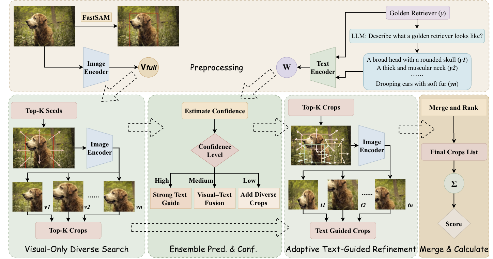

<h1 align="center">LAGO</h1>

<p align="center">
  <strong>Language-Guided Adaptive Object-Region Focus for Zero-Shot Visual–Text Alignment</strong><br>
</p>

<p align="center">
  <a href="https://arxiv.org/abs/" style="text-decoration:none !important;">
    
  </a>
  <a href="https://opensource.org/licenses/MIT" style="text-decoration:none !important;">
    
  </a>
</p>

<p align="center">
  
</p>

---

## Overview

LAGO is a training-free zero-shot recognition framework built on frozen CLIP encoders. It improves visual-text alignment by replacing exhaustive random crop enumeration with a compact set of object-centric regions, then refining those regions with language guidance only when the intermediate prediction is reliable enough.

The goal is simple: look at fewer regions, choose better evidence, and avoid reinforcing early zero-shot mistakes.

## Code availability

The full training and evaluation code will be **open-sourced after the paper is accepted**. This repository currently hosts the project page, overview, and citation information; we appreciate your patience until release.

## Citation
If this repository is helpful in your research, please consider citing our paper.
```bibtex
@article{lago2026,
  title  = {LAGO: Language-Guided Adaptive Object-Region Focus for Zero-Shot Visual-Text Alignment},
  author = {LAGO Authors},
  year   = {2026}
}
```

## License

This project is released under the MIT License. See `LICENSE` for details.

## Acknowledgments

We thank the following papers and projects for their open-source code and models, which LAGO builds upon and relates to:

- Learning Transferable Visual Models From Natural Language Supervision [[ICML 2021]](https://github.com/openai/CLIP)
- Fast Segment Anything [[arXiv 2023]](https://github.com/CASIA-IVA-Lab/FastSAM)
- Visual Classification via Description from Large Language Models [[ICLR 2023 Oral]](https://github.com/sachit-menon/classify_by_description_release)
- What does a platypus look like? Generating customized prompts for zero-shot image classification [[ICCV 2023]](https://github.com/sarahpratt/CuPL)
- Waffling around for Performance: Visual Classification with Random Words and Broad Concepts [[ICCV 2023]](https://github.com/ExplainableML/WaffleCLIP)
